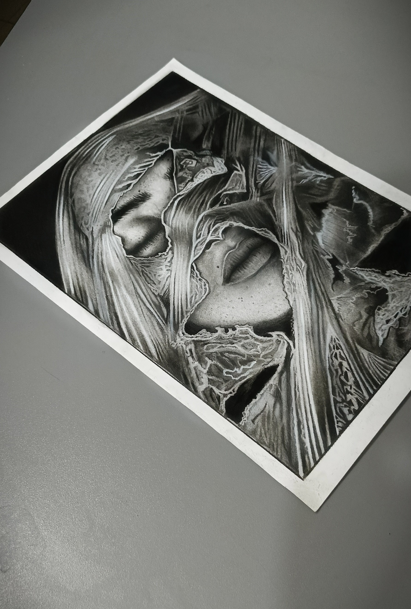
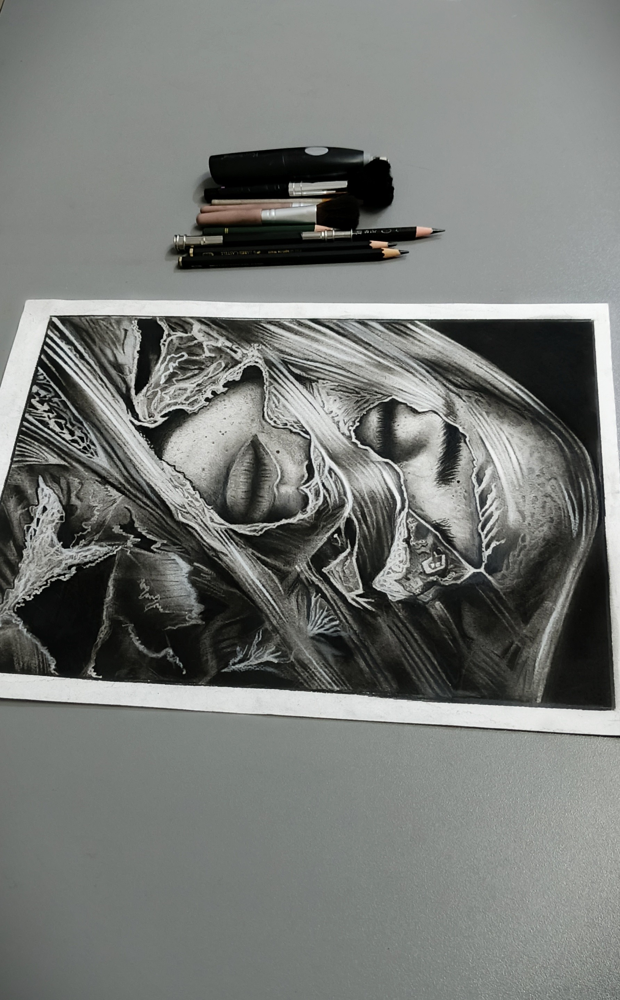
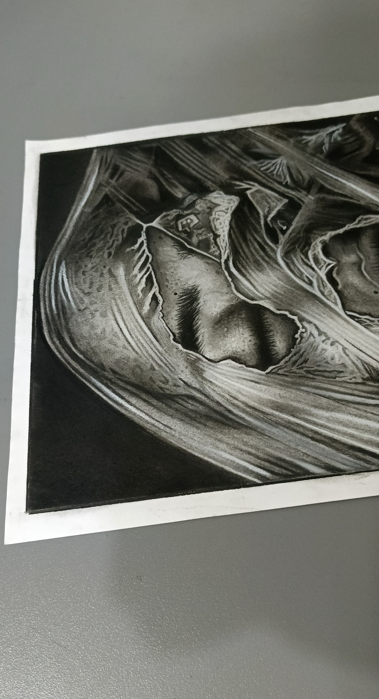

# Hyper-Realistic Charcoal Sketch: Torn Plastic Over Face

## Overview
Welcome to the repository showcasing an advanced, highly intricate hyper-realistic traditional artwork. Created by 18-year-old hyper-realism artist **Abdullah Irfan**, this piece tackles an extreme technical challenge: capturing the complex textures, highlights, and tension of a torn, stretched plastic bag wrapped over a girl's face.

---

## Art Specifications
* **Artist:** Abdullah Irfan (Instagram: [@the_shadedartist](https://instagram.com/the_shadedartist))
* **Artist Age:** 18 Years Old
* **Medium:** Pure Charcoal (Charcoal Pencils & Charcoal Powder)
* **Surface Size:** A3 Paper
* **Key Techniques:** 
  * Seamless blending using charcoal powder to render the soft skin, freckles, and facial features visible beneath the layers.
  * Ultra-precise edge-work and high-contrast highlights to mimic the synthetic, light-reflective properties of torn, crinkled plastic.
  * Micro-detail execution on the frayed, stretched, and ripped borders of the plastic wrapping.

---

## Visual Preview
The original high-resolution photograph of the artwork is stored in this repository as `w2.jpg`.

  
  
  

---

## Creative Process & Technical Difficulty
Executed entirely on A3 paper using only charcoal pencils and powder, the core complexity of this piece lies in the dual-layer illusion. The artist must simultaneously communicate the transparency of the plastic, the sharp highlights of its folds, and the soft depth of the female face resting underneath. 

Because charcoal is inherently deep and matte, achieving the glossy, semi-translucent look of stretched synthetic plastic required meticulous erasing techniques and absolute control over gradients. Every rip and tear carries its own intense highlight, contrasting sharply against the pitch-black shadows to create a striking three-dimensional effect.

For more behind-the-scenes content and to see the progression of my portfolio, follow me on Instagram: **@the_shadedartist**.

---

*Copyright © 2026 Abdullah Irfan (@the_shadedartist). All rights reserved. This image and artwork cannot be used, reproduced, or modified without explicit permission from the artist.*
